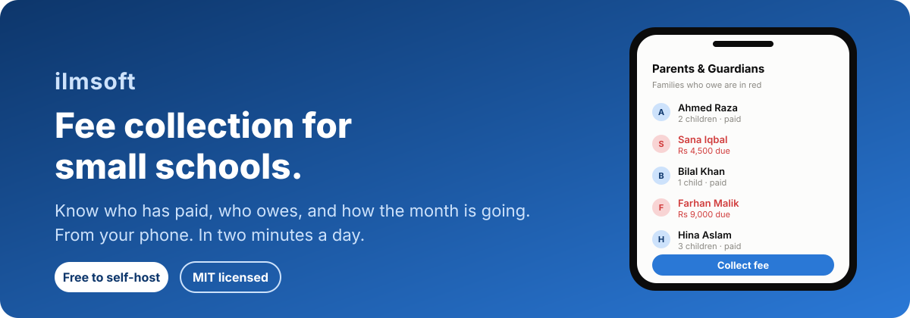
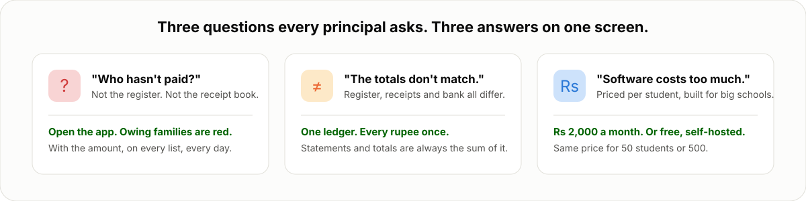
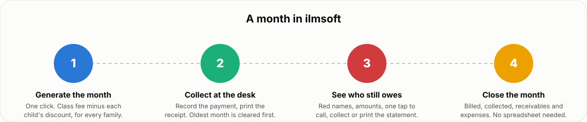
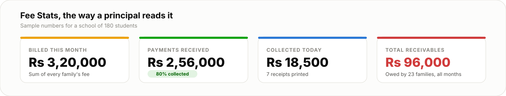
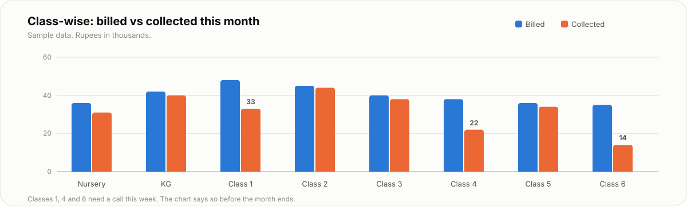

<p align="center">
  
</p>

<p align="center">
  <a href="https://ilmsoft.netlify.app"><strong>Try it</strong></a> ·
  <a href="#what-it-costs">What it costs</a> ·
  <a href="#run-it-for-your-own-school">Run it yourself</a> ·
  <a href="#for-developers">For developers</a>
</p>

# ilmsoft

You run a school of 50 to 500 students. Every month the same questions come back: who has paid, who owes, how much came in today, and does the register agree with the receipt book. ilmsoft answers those questions on one screen, from your phone, without a spreadsheet and without an accountant.

It is used every day at a real school in Pakistan. It is free to run on your own, or Rs 2,000 a month hosted. MIT licensed.

<p align="center">
  
</p>

## A month in ilmsoft

<p align="center">
  
</p>

**Generate the month.** Every class has a monthly fee. Every child may have a discount, in rupees or percent. One click bills every family the class fee minus the discount. Raise a class fee and every child in that class is billed the new amount next month. Nothing to recalculate by hand.

**Collect at the desk.** Record the payment, print the receipt. The oldest unpaid month is cleared first, so partial payments never get lost.

**See who still owes.** Families with dues are shown in red, with the amount, on the parents list and on Fee Stats. Tap a name to call, collect, or print their statement.

**Close the month.** Billed, collected, receivables and expenses are on one page. Your income, expenses, book sales and supplier bills live in the same place as fees, so the month's picture is complete.

## The numbers a principal actually reads

<p align="center">
  
</p>

<p align="center">
  
</p>

## What you get

- **Families and children in one place.** Register a parent once, add the children, promote a whole class at year end.
- **Fees that follow one rule.** Class fee minus the child's discount. That rule is enforced in the database, so a fee can never come from two places.
- **A ledger you can trust.** Every rupee is written once. Balances, statements and totals are always the sum of that ledger. Nothing can drift.
- **Receipts, invoices and result cards on demand.** Print or reprint any of them any time; they are drawn from the records, never stored as copies.
- **Exams and result cards** in your school's colours.
- **A team without risk.** Invite managers who can do the daily work but cannot change fees, delete records or touch billing.
- **Works on a phone.** The whole thing is designed for the screen you already carry.

## What it costs

| Choice | Price | What you get |
|---|---|---|
| Hosted at ilmsoft.netlify.app | Rs 2,000 for 30 days, or Rs 5,000 for 100 days | Sign up, add your school, start today. Pay by JazzCash or bank transfer. Same price for 50 students or 500. |
| Run it yourself | Free | The code is MIT licensed. Host it on your own free Supabase and Netlify accounts. |

If your hosted subscription lapses, the school becomes read-only. Nothing is ever deleted.

## Run it for your own school

You need a free [Supabase](https://supabase.com) project and a free [Netlify](https://netlify.com) account, and someone comfortable with a terminal for an afternoon.

```bash
git clone https://github.com/1ArxAI/ilmsoft.git
cd ilmsoft
npm install
cp .env.example .env.local   # paste your Supabase URL and publishable key
npm run dev
```

**Honest note:** the repository carries the incremental database migrations in `sql/` that were applied to the production project, but not yet one bootstrap file for a fresh Supabase project. That is the next thing to publish. Open an issue if you want to run your own instance now and we will walk you through it.

## Built to stay simple

1. **One fee rule**, computed in the database.
2. **One ledger**, the only source of truth for money.
3. **Six runtime dependencies** and no server of our own. The browser talks to Postgres through Supabase; row-level security decides who sees what.
4. **Each school is walled off in the database**, not just in the interface.
5. **If a small school does not need it on a normal day, it is not here.**

## For developers

<details>
<summary>Stack, scripts, roles and contributing</summary>

**Stack.** React 19, TypeScript, Vite, SWR, lucide-react on the client. Supabase (Postgres, Auth, Storage) as the only backend. Static hosting on Netlify. Node 22.

**Scripts.** `npm run dev`, `npm run build`, `npm test`, `npm run lint`, `npm run typecheck`.

**Operations scripts** (read connection details from `.env.local`):

| Script | What it does |
|---|---|
| `scripts/db_dump.mjs` | Full logical backup of the live database (schema plus every table as JSON) into `backups/`. |
| `scripts/db_restore.mjs` | Restore a dump, table by table, with an explicit confirmation. |
| `scripts/backup_to_baserow.mjs` | Zip the newest dump and upload it to a Baserow table, keeping the last three. Runs nightly from GitHub Actions. |
| `scripts/migrate_to_project.mjs` | Rebuild the whole database in a new Supabase project (for example to change region) and verify the copy against the original. |

**Roles.** Owner: everything for their school. Manager: daily work (families, students, payments, fee generation, exams, income and expenses) but no deleting financial history, changing class fees or managing the team. Platform admin: approves credit purchases and can read, not write, school data. Permanent deletion of a family or student is refused if any financial history exists.

**Contributing.** Small pull requests that remove something are the most welcome. Before adding a feature, ask whether a small school needs it on a normal day. Keep the one fee rule and the one ledger intact, and keep every table behind row-level security. Run `npm run typecheck`, `npm run lint` and `npm test` before opening a PR.

</details>

## License

[MIT](LICENSE). Use it, change it, run it for your school.
